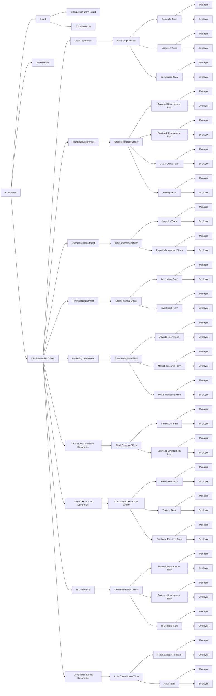

```mermaid
flowchart LR;
    COMPANY --> BOARD[Board];
    COMPANY --> SHAREHOLDER[Shareholders];
    COMPANY --> CEO[Chief Executive Officer];

    BOARD --> CHAIRPERSON[Chairperson of the Board];
    BOARD --> DIRECTOR[Board Directors];

    CEO --> legalDepartment[Legal Department];
    CEO --> technicalDepartment[Technical Department];
    CEO --> operationsDepartment[Operations Department];
    CEO --> financialDepartment[Financial Department];
    CEO --> marketingDepartment[Marketing Department];
    CEO --> strategyDepartment[Strategy & Innovation Department];
    CEO --> hrDepartment[Human Resources Department];
    CEO --> ITDepartment[IT Department];
    CEO --> complianceDepartment[Compliance & Risk Department];

    legalDepartment --> CLO[Chief Legal Officer];
    CLO --> copyrightTeam[Copyright Team];
    CLO --> litigationTeam[Litigation Team];
    CLO --> complianceTeam[Compliance Team];
    copyrightTeam --> copyrightManager[Manager];
    copyrightTeam --> copyrightEmployee[Employee];
    litigationTeam --> litigationManager[Manager];
    litigationTeam --> litigationEmployee[Employee];
    complianceTeam --> complianceManager[Manager];
    complianceTeam --> complianceEmployee[Employee];

    technicalDepartment --> CTO[Chief Technology Officer];
    CTO --> backendTeam[Backend Development Team];
    CTO --> frontendTeam[Frontend Development Team];
    CTO --> dataScienceTeam[Data Science Team];
    CTO --> securityTeam[Security Team];
    backendTeam --> backendManager[Manager];
    backendTeam --> backendEmployee[Employee];
    frontendTeam --> frontendManager[Manager];
    frontendTeam --> frontendEmployee[Employee];
    dataScienceTeam --> dataScienceManager[Manager];
    dataScienceTeam --> dataScienceEmployee[Employee];
    securityTeam --> securityManager[Manager];
    securityTeam --> securityEmployee[Employee];

    operationsDepartment --> COO[Chief Operating Officer];
    COO --> logisticsTeam[Logistics Team];
    COO --> projectManagementTeam[Project Management Team];
    logisticsTeam --> logisticsManager[Manager];
    logisticsTeam --> logisticsEmployee[Employee];
    projectManagementTeam --> pmManager[Manager];
    projectManagementTeam --> pmEmployee[Employee];

    financialDepartment --> CFO[Chief Financial Officer];
    CFO --> accountingTeam[Accounting Team];
    CFO --> investmentTeam[Investment Team];
    accountingTeam --> accountingManager[Manager];
    accountingTeam --> accountingEmployee[Employee];
    investmentTeam --> investmentManager[Manager];
    investmentTeam --> investmentEmployee[Employee];

    marketingDepartment --> CMO[Chief Marketing Officer];
    CMO --> advertisementTeam[Advertisement Team];
    CMO --> marketResearchTeam[Market Research Team];
    CMO --> digitalMarketingTeam[Digital Marketing Team];
    advertisementTeam --> adManager[Manager];
    advertisementTeam --> adEmployee[Employee];
    marketResearchTeam --> researchManager[Manager];
    marketResearchTeam --> researchEmployee[Employee];
    digitalMarketingTeam --> digitalMarketingManager[Manager];
    digitalMarketingTeam --> digitalMarketingEmployee[Employee];

    strategyDepartment --> CSO[Chief Strategy Officer];
    CSO --> innovationTeam[Innovation Team];
    CSO --> businessDevelopmentTeam[Business Development Team];
    innovationTeam --> innovationManager[Manager];
    innovationTeam --> innovationEmployee[Employee];
    businessDevelopmentTeam --> bizDevManager[Manager];
    businessDevelopmentTeam --> bizDevEmployee[Employee];

    hrDepartment --> CHRO[Chief Human Resources Officer];
    CHRO --> recruitmentTeam[Recruitment Team];
    CHRO --> trainingTeam[Training Team];
    CHRO --> employeeRelationsTeam[Employee Relations Team];
    recruitmentTeam --> recruitmentManager[Manager];
    recruitmentTeam --> recruitmentEmployee[Employee];
    trainingTeam --> trainingManager[Manager];
    trainingTeam --> trainingEmployee[Employee];
    employeeRelationsTeam --> relationsManager[Manager];
    employeeRelationsTeam --> relationsEmployee[Employee];

    ITDepartment --> CIO[Chief Information Officer];
    CIO --> networkTeam[Network Infrastructure Team];
    CIO --> softwareDevelopmentTeam[Software Development Team];
    CIO --> ITSupportTeam[IT Support Team];
    networkTeam --> networkManager[Manager];
    networkTeam --> networkEmployee[Employee];
    softwareDevelopmentTeam --> softwareDevManager[Manager];
    softwareDevelopmentTeam --> softwareDevEmployee[Employee];
    ITSupportTeam --> ITSupportManager[Manager];
    ITSupportTeam --> ITSupportEmployee[Employee];

    complianceDepartment --> CCO[Chief Compliance Officer];
    CCO --> riskManagementTeam[Risk Management Team];
    CCO --> auditTeam[Audit Team];
    riskManagementTeam --> riskManager[Manager];
    riskManagementTeam --> riskEmployee[Employee];
    auditTeam --> auditManager[Manager];
    auditTeam --> auditEmployee[Employee];
```