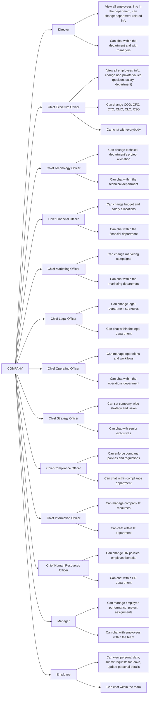

```mermaid
flowchart LR;
    COMPANY --> DIRECTOR[Director];
    COMPANY --> CEO[Chief Executive Officer];
    COMPANY --> CTO[Chief Technology Officer];
    COMPANY --> CFO[Chief Financial Officer];
    COMPANY --> CMO[Chief Marketing Officer];
    COMPANY --> CLO[Chief Legal Officer];
    COMPANY --> COO[Chief Operating Officer];
    COMPANY --> CSO[Chief Strategy Officer];
    COMPANY --> CCO[Chief Compliance Officer];
    COMPANY --> CIO[Chief Information Officer];
    COMPANY --> CHRO[Chief Human Resources Officer];
    COMPANY --> MANAGER[Manager];
    COMPANY --> EMPLOYEE[Employee];
    
    %% CEO Level
    CEO --> fullPermission["View all employees' info, change non-private values (position, salary, department)"];
    CEO --> CEOPermission[Can change COO, CFO, CTO, CMO, CLO, CSO];
    CEO --> fullChatPermission[Can chat with everybody];

    %% Director Level
    DIRECTOR --> directorPermission[View all employees' info in the department, can change department-related info];
    DIRECTOR --> directorChatPermission[Can chat within the department and with managers];

    %% C-Level Executives
    CTO --> technicalDepartmentPermission[Can change technical department's project allocation];
    CTO --> CTOChatPermission[Can chat within the technical department];
    CFO --> financialDepartmentPermission[Can change budget and salary allocations];
    CFO --> CFOChatPermission[Can chat within the financial department];
    CMO --> marketingDepartmentPermission[Can change marketing campaigns];
    CMO --> CMOChatPermission[Can chat within the marketing department];
    CLO --> legalDepartmentPermission[Can change legal department strategies];
    CLO --> CLOChatPermission[Can chat within the legal department];
    COO --> operationalPermission[Can manage operations and workflows];
    COO --> COOChatPermission[Can chat within the operations department];
    CSO --> strategyPermission[Can set company-wide strategy and vision];
    CSO --> CSOChatPermission[Can chat with senior executives];
    CCO --> compliancePermission[Can enforce company policies and regulations];
    CCO --> CCOChatPermission[Can chat within compliance department];
    CIO --> informationPermission[Can manage company IT resources];
    CIO --> CIOChatPermission[Can chat within IT department];
    CHRO --> hrPermission[Can change HR policies, employee benefits];
    CHRO --> HRChatPermission[Can chat within HR department];

    %% Manager Level
    MANAGER --> managerPermission[Can manage employee performance, project assignments];
    MANAGER --> managerChatPermission[Can chat with employees within the team];

    %% Employee Level
    EMPLOYEE --> employeePermission[Can view personal data, submit requests for leave, update personal details];
    EMPLOYEE --> employeeChatPermission[Can chat within the team];
```